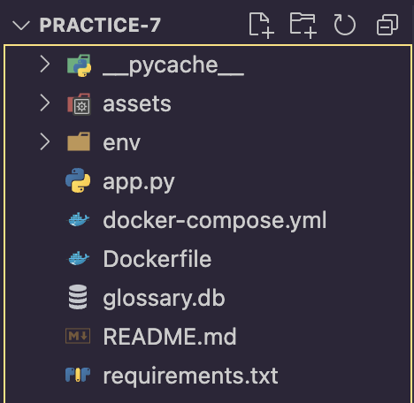
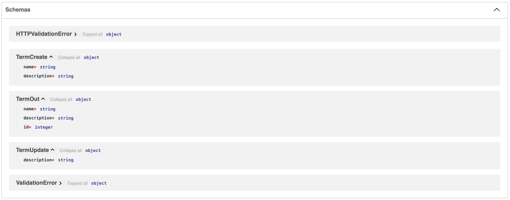
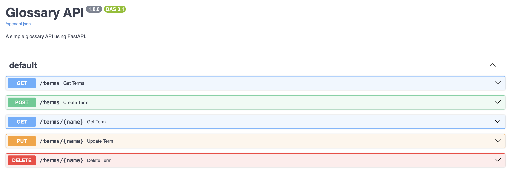
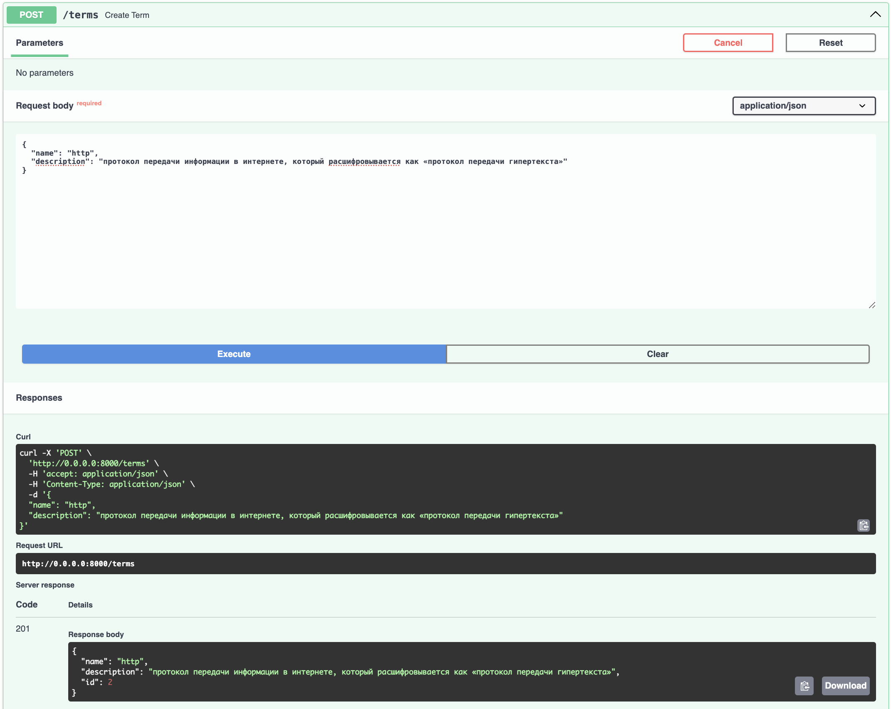
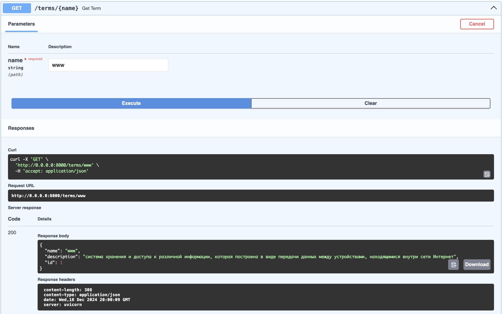
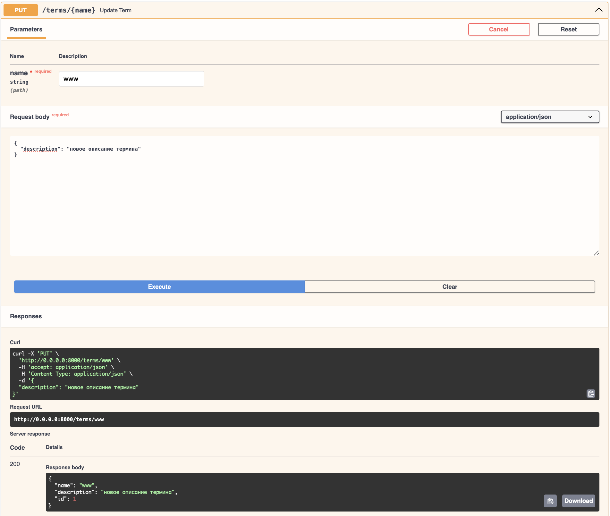
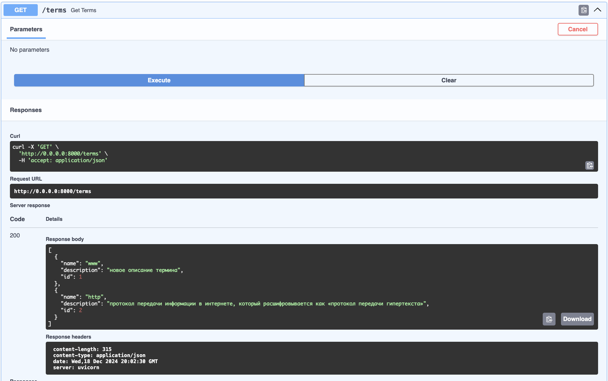
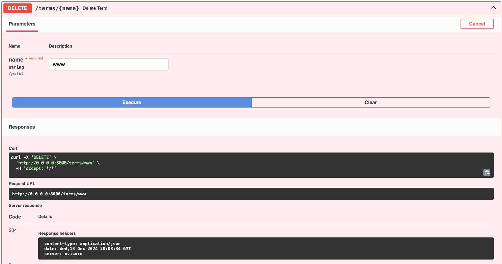
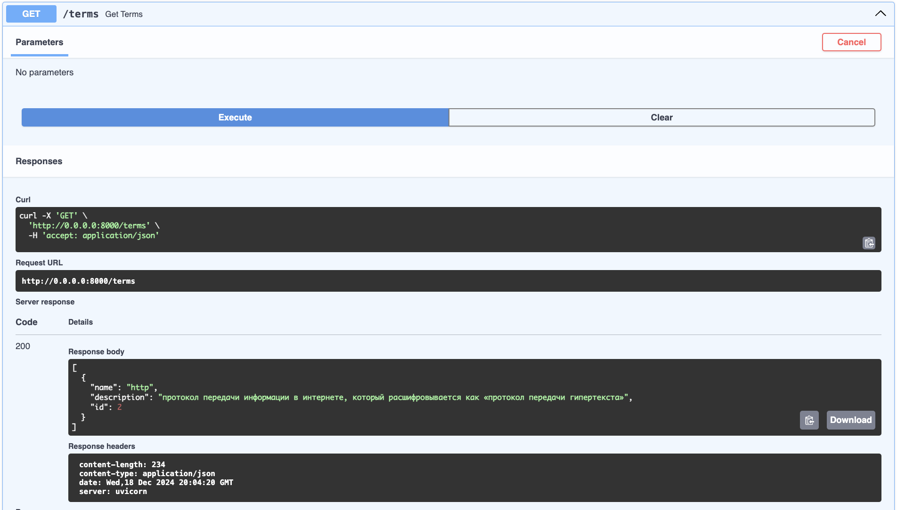

# Проектирование и развертывание веб-решений в эко-системе Python

## Задание

Реализуйте задание практики, опубликованное по ссылке, с использованием FastAPI, предоставьте ссылку на репозиторий GitHub со всеми необходимыми компонентами для развертывания. При возможности, разверните словарь на публичном сервере в вебе.

В репозитории отразите отчет с помощью файла с разметкой Markdown, где демонстрировался бы процесс развертывания и работы сервиса.

Глоссарий должен поддерживать следующие операции:

- Получение списка всех терминов.
- Получение информации о конкретном термине по ключевому слову.
- Добавление нового термина с описанием.
- Обновление существующего термина.
- Удаление термина из глоссария.
  \*У вас должен применяться Pydantic для валидации входных данных и формирования схем.

Будет плюсом, если вы:

- найдете и используете по назначению инструмент для автоматической генерации статической документации с помощью встроенной OpenAPI-спецификации FastAPI;

- реализуйте решение в виде контейнера (Dockerfile) или реализуйте решение с помощью Docker Compose;

- используете для хранения данных SQLite (или другую легковесную БД);

- обеспечите автоматическую миграцию структуры данных при старте приложения.

## Выполнение задания

### Процесс развертывания

#### 1. Локальное развертывание

1. Клонируйте репозиторий

```
git clone ..
cd practice-7
```

2. Установите зависимости

```
pip install -r requirements.txt
```

3. Запустите приложение

```
uvicorn app:app --reload
```

4. Откройте браузер и перейдите по адресу http://localhost:8000/docs для просмотра документации.

#### 2. Развертывание с docker

1. Клонируйте репозиторий

```
git clone ..
cd practice-7
```

2. Соберите и запустите контейнер

```
docker-compose up --build
```

3. API будет доступно по адресу http://localhost:8000

### Используемые библиотеки

- FastAPI: Основной фреймворк для создания REST API, предоставляющий простую настройку маршрутов и автоматическую генерацию OpenAPI-документации.
- Pydantic: Используется для валидации входных данных и формирования схем данных, что гарантирует их корректность.
- Uvicorn: Легковесный ASGI-сервер для запуска приложения.
- SQLite: Легковесная база данных для хранения терминов.
- SQLAlchemy: ORM для работы с базой данных, что упрощает выполнение CRUD-операций.

### Использование Базы данных

Используется база данных SQLite для хранения и управления терминами в глоссарии. Для работы с базой данных используется SQLAlchemy — популярная ORM (Object-Relational Mapping) библиотека, которая позволяет взаимодействовать с базой данных через объекты Python

- В приложении настроен URL подключения к базе данных SQLite: `DATABASE_URL = "sqlite:///./glossary.db"`, где база данных хранится в файле `glossary.db` в текущей директории.
  
- Создается объект `engine` с использованием `create_engine`, который управляет соединением с базой данных.
- Создается объект `SessionLocal` с помощью `sessionmaker`, который используется для создания сессий для выполнения запросов и транзакций.

`Term` — это класс, который представляет таблицу terms в базе данных. Он наследуется от `Base`, который является основой для всех моделей данных в `SQLAlchemy`. Этот класс определяет:

- `id`: идентификатор термина, который является первичным ключом.
- `name`: название термина, уникальное и индексируемое.
- `description`: описание термина, не может быть пустым

После создания модели, вызывается `Base.metadata.create_all(bind=engine)`, чтобы создать таблицу terms в базе данных, если она еще не существует.

Функция `get_db()` создает и управляет сессиями с базой данных. Она используется в качестве зависимости `(Depends(get_db))` для обработки всех запросов, которые взаимодействуют с базой данных. Сессия автоматически закрывается после выполнения запроса.

### Схемы данных

Для работы с терминологией используются следующие схемы, реализованные с помощью `Pydantic`

- `TermBase`: Базовая схема термина, используемая для описания всех терминов, хранящихся в базе данных

```
class TermBase(BaseModel):
    name: str
    description: str
```

- `TermCreate`: Схема для создания нового термина. Наследуется от TermBase и используется в `POST /terms`

```
class TermCreate(TermBase):
    pass
```

- `TermUpdate`: Схема для обновления термина. Используется в `PUT /terms/{name}`

```
class TermUpdate(BaseModel):
    description: str
```

Схемы: 

### Функциональность сервиса

- Получение всех терминов: `GET /terms`

- Получение термина по имени: `GET /terms/{name}`

- Добавление нового термина: `POST /terms`

- Обновление описания термина: `PUT /terms/{name}`

- Удаление термина: `DELETE /terms/{name}`



### Примеры работы

#### Создание термина



#### Вывод всех терминов


#### Получение одного термина



#### Измение термина




#### Удаление термина



